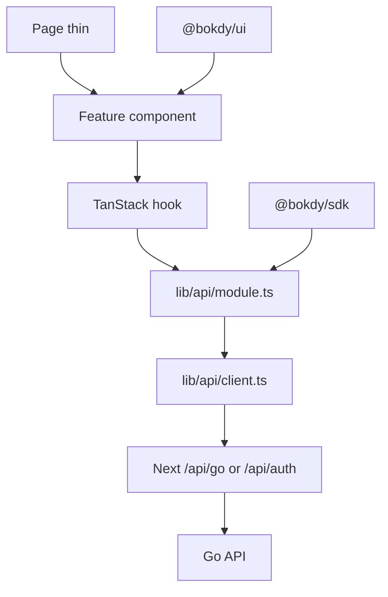

# Frontend Feature Playbook

Version: 1.0

Status: Active

This document is the **implementation workflow** for adding or changing a frontend screen or UI feature in a Next.js app.

It does not replace architecture or domain source of truth.

If a rule here conflicts with another document, follow the Source of Truth Priority in `docs/00-ai-context.md`.

Backend / HTTP API work is out of scope here. Use:

```text
docs/architecture/backend-feature-playbook.md
```

---

# When to use

Read this playbook **after** domain docs and **before** generating code whenever the change includes any of:

- a new or changed App Router page
- a new feature component, hook, or `lib/api` module
- a new shared primitive in `packages/ui`
- wiring an existing OpenAPI operation into Player / Owner / Admin UI

Do not use this playbook to invent APIs, tables, permissions, statuses, or synonyms.

---

# Pre-flight (read before code)

Do not invent screens, terms, or HTTP paths.

Read in this order for the feature:

1. Use case — `docs/use-cases/`
2. Module scope — `docs/modules/`
3. Aggregate and invariants — `docs/domain/domain-model.md`
4. Status transitions — `docs/domain/status-lifecycle.md`
5. Permissions — `docs/domain/permission-matrix.md` (when the action is gated)
6. Glossary — `docs/domain/domain-glossary.md`
7. OpenAPI — `api/openapi/openapi.yaml`
8. This playbook
9. Next.js 16 docs in that app’s `node_modules/next/dist/docs/` (this is **not** the Next.js of training data; Next 16 uses `proxy.ts`, not `middleware.ts`)

If the use case, OpenAPI operation, or permission is missing, **stop and ask**. Do not design a new endpoint or business term on the frontend.

Foundation freeze (`AGENTS.md`): do not implement Booking, Court, Payment, or CRM Customer UI unless explicitly requested — even if later use-case docs exist.

---

# Identify before coding

Write down (explicitly, even in a short note):

| Question | Example |
| --- | --- |
| Audience app | `apps/owner-web` |
| Bounded context | `organization` |
| Use case ID | UC-ORG-001 |
| OpenAPI operation | `POST /api/v1/organizations` |
| Permission | from `permission-matrix.md` when defined |
| Auth gate | logged-in Owner + optional `X-Organization-ID` |

Audiences (one feature belongs to **exactly one** app unless the same UX is explicitly required in another):

- **Player** — `apps/player-web` (port 3000)
- **Owner** — `apps/owner-web` (port 3001)
- **Admin** — `apps/admin-web` (port 3002)

Never merge portals. Never import source from another app. Shared code goes in `packages/`.

---

# Implementation order (frozen)

UI last. Never start from a fat `page.tsx` that calls `fetch`.

```text
1. Confirm the OpenAPI operation exists (same change as backend if the API is new)
2. pnpm --filter @bokdy/sdk generate (if openapi.yaml changed)
3. lib/api/<module>.ts — typed wrappers over /api/go (SDK types)
4. hooks/use-<module>.ts — query-key factory + useQuery / useMutation
5. i18n keys in messages/en.json and messages/vi.json
6. React Hook Form + Zod for the first multi-field domain form (already named in tech-stack.md)
7. Feature components; primitives from @bokdy/ui only
8. Thin page on the correct audience app; extend proxy.ts if the route needs auth
9. Loading / Empty / Error; map error.code → next-intl
10. Permission UI from session + permission-matrix (hide CTA; backend remains authority)
11. Locale-aware navigation (next-intl createNavigation)
12. Mobile-first layout
```

```text
Read UC / module / OpenAPI / glossary
        │
        ▼
SDK types (@bokdy/sdk)
        │
        ▼
lib/api client + module
        │
        ▼
TanStack Query hook
        │
        ▼
i18n + feature components + @bokdy/ui
        │
        ▼
Thin page + proxy gate
        │
        ▼
Loading / Empty / Error + permission UI
```

---

# Layer responsibilities

```text
Page → Feature component → Hook → lib/api → Next BFF → Go /api/v1
```



Dependencies only flow downward.

| Layer | May | Must not |
| --- | --- | --- |
| **Page** | Route, compose sections, metadata, audience/permission shell | `fetch`, Go paths, business rules, fat JSX |
| **Feature component** | Render, bind form, call hooks, toast / navigate | Know `/api/v1/...`, hold JWT |
| **Hook** | Query keys, `useQuery` / `useMutation`, invalidate | Toast, `router.push`, React markup |
| **`lib/api`** | Call `/api/go/*` or `/api/auth/*`, unwrap `{ data }`, typed errors | React, toast, redirect |
| **BFF `app/api/*`** | Cookie → `Authorization`, proxy to Go | Business rules, new domain logic |
| **`@bokdy/ui`** | Primitives and chrome reused by **two or more** apps | Audience-only screens |

Auth exception: existing login/register pages talk to `/api/auth/*`. New **domain** data always goes through `/api/go/...`. When you next touch an auth page, move `fetch` into a hook + `lib/api` — do not drive-by refactor all three apps in an unrelated task.

Browser **never** holds JWT. Tokens stay in httpOnly cookies (`lib/auth.ts`). The readable `*_auth` cookie is only a presence flag for `proxy.ts`.

---

# App folder layout (frozen)

Each app stays independently deployable. There is no `src/` wrapper. Path alias: `@/*` → app root.

Scaffold today has only `app/`, `lib/auth.ts`, `lib/api/proxy-go.ts`, `messages/`, `i18n/`, `providers/`, `proxy.ts`. New feature work **creates** the folders below — do not invent `src/modules/`, a FE service layer, or Zustand.

```text
apps/<audience>-web/
  app/
    [locale]/
      <feature>/page.tsx          # thin route
    api/
      auth/*                      # existing BFF auth
      go/[...path]/route.ts       # existing Go proxy
  components/<feature>/           # audience-specific UI
  hooks/use-<feature>.ts
  lib/
    auth.ts                       # existing cookie names
    api/
      proxy-go.ts                 # existing server proxy helper
      client.ts                   # browser wrapper → /api/go
      <module>.ts
    validation/                   # Zod schemas when forms exist
  i18n/
    routing.ts
    request.ts
    navigation.ts                 # add with createNavigation
  messages/
    en.json
    vi.json
  providers/providers.tsx         # QueryClient already wired
  proxy.ts                        # Next 16 request proxy
```

## Naming (reconcile docs vs scaffold)

- Component **exports**: PascalCase (`OrganizationList`)
- Hook **exports**: `useOrganizations`, `useCreateOrganization`
- **Files and directories**: kebab-case (`organization-list.tsx`, `use-organizations.ts`) — matches `@bokdy/ui` (`auth-card.tsx`, `button.tsx`)
- Wire JSON: **snake_case** as in OpenAPI / `@bokdy/sdk` (`full_name`, `access_token`). Do not add a camelCase mapping layer. (`naming-convention.md` JSON section is secondary to the live API.)

## What belongs where

| Put it in | When |
| --- | --- |
| `apps/<app>/components/` | UI for one audience |
| `apps/<app>/hooks/` + `lib/api/` | Data for that app (cookies and audience differ) |
| `packages/ui` | Primitive or shared chrome used by **≥ 2** apps; export from `packages/ui/src/index.ts` |
| `packages/sdk` | Generated OpenAPI types only |

Do **not**:

- copy `Button` / `Input` into an app
- `import` from `apps/owner-web` inside `apps/admin-web`
- create `packages/types` (SDK already exports types)
- extract a shared hooks package unless explicitly requested

Reuse order: **Reuse → Compose → Extend → Create**. Search existing `@bokdy/ui`, hooks, and pages before adding files.

---

# Data fetching and state

TanStack Query is already provided in `providers/providers.tsx`. Use it for all server state.

| Kind | Owner |
| --- | --- |
| Server data | TanStack Query |
| Forms | React Hook Form + Zod (`tech-stack.md`; add the packages on the first multi-field domain form — do not invent another form library) |
| Local UI (open dialog, tab) | `useState` / `useReducer` |
| List filters + page | URL search params |

Do **not** introduce Zustand, Redux, or a global store for server data.

### `lib/api` pattern

Browser code calls same-origin BFF, never `localhost:8088` and never `NEXT_PUBLIC_API_URL` for authenticated domain calls.

```ts
// apps/owner-web/lib/api/client.ts (create on first domain wire)
export async function apiGo<T>(path: string, init?: RequestInit): Promise<T> {
  const res = await fetch(`/api/go/${path.replace(/^\//, "")}`, {
    ...init,
    headers: {
      Accept: "application/json",
      ...(init?.body ? { "Content-Type": "application/json" } : {}),
      ...init?.headers,
    },
  });
  if (res.status === 204) return undefined as T;
  const json = await res.json().catch(() => ({}));
  if (!res.ok) {
    throw new ApiError(json.code ?? "INTERNAL", json.message, res.status, json.details);
  }
  return (json.data ?? json) as T;
}
```

Success envelope (live `httpx`): `{ "data": ... }`.

Error envelope (live `httpx`): `{ "code": "VALIDATION", "message": "...", "details?": [{ "field", "code", "message" }] }`.

Codes are UPPERCASE. Source of truth: `packages/config/error-codes.json` (import `@bokdy/config/error-codes.json`). Envelope: `UNAUTHORIZED`, `FORBIDDEN`, `NOT_FOUND`, `CONFLICT`, `VALIDATION`, `BAD_REQUEST`, `TOO_MANY_REQUESTS`, `INTERNAL`. Field `details[].code`: `REQUIRED`, `EMAIL_INVALID`, `TOO_SHORT`, `TOO_LONG`, `UUID_INVALID`, `ONE_OF`, `INVALID`.

Map `code` through next-intl `errors.*` (same key as the catalog). Form fields: `t("errors." + details[].code)`. **Never** show raw `message` to the user as the only copy. Use `lib/api/errors.ts` (`readApiError`).

Types: import from `@bokdy/sdk`. Prefer `components["schemas"]["CreateOrganizationRequest"]` (or the generated `paths` operation types). Do not hand-write a parallel DTO file.

### Hook pattern

```ts
export const organizationKeys = {
  all: ["organizations"] as const,
  list: () => [...organizationKeys.all, "list"] as const,
};

export function useOrganizations() {
  return useQuery({
    queryKey: organizationKeys.list(),
    queryFn: () => organizationsApi.list(),
  });
}

export function useCreateOrganization() {
  const queryClient = useQueryClient();
  return useMutation({
    mutationFn: organizationsApi.create,
    onSuccess: () => {
      void queryClient.invalidateQueries({ queryKey: organizationKeys.all });
    },
  });
}
```

Page / component: loading → empty → error → data. Mutations: invalidate keys; toast from `code` via i18n; map validation field errors onto the form.

### Lists

Keep `q`, filters, and `page` in the URL. Returning from detail uses an explicit list href (including current query), not `router.back()`.

### Public vs dashboard

These apps are authenticated workspaces. Default to client TanStack Query. Only add RSC + `initialData` when a public SEO page exists and is specified.

---

# Auth, proxy, and permissions

Existing BFF (do not replace):

| Route | Role |
| --- | --- |
| `POST /api/auth/login` `register` `refresh` `logout` | Set / clear httpOnly cookies; send `X-Client` (`player` / `owner` / `admin`) |
| `GET /api/auth/session` | Proxies `GET /api/v1/identity/me` |
| `/api/go/[...path]` | Proxies `/api/v1/{path}` with Bearer + `X-Organization-ID` + `Accept-Language` + `traceparent` + `X-Trace-ID` |

Cookie prefixes differ per app (`bokdy_owner_session`, …). Do not share cookies across Player / Owner / Admin.

`proxy.ts` currently protects `/{en\|vi}/dashboard`. When adding a new authenticated route tree, extend that matcher (or equivalent) so guests redirect to `/{locale}/login`. Do not create `middleware.ts`.

Owner tenant context: BFF already forwards `X-Organization-ID` from the org cookie. Set that cookie when the user selects an organization — do not invent a second tenant header.

Locale: forward the browser `Accept-Language` (match `[locale]` segment, e.g. `vi` or `en`). Missing header → Go defaults to `vi`. Do not send `X-Locale` or `?locale=`. Read models expose resolved `name`; owner edit forms use `name_en` + `name_vi`. See `docs/architecture/i18n.md`.

Trace: BFF mints W3C `traceparent` + 32-hex `X-Trace-ID` when the browser omits them (`goProxyHeaders`), forwards them to Go, and echoes them on the response. See `docs/architecture/observability.md`.

Permissions:

- Source of truth: `docs/domain/permission-matrix.md` + backend
- UI may hide buttons from `/api/auth/session` (`identity/me`) when that payload exposes permission codes
- Until the matrix and `me` payload define codes, **do not invent** a FE permission catalog
- A 403 from Go is still authoritative; show a forbidden / empty-permission state

---

# i18n and copy

- Library: next-intl. Locales: `en` (default), `vi`. `localePrefix: "always"`.
- Every user-facing string goes through translations. No hardcoded English or Vietnamese in JSX (except brand name already in `common.appName`).
- Keep the current two files: `messages/en.json`, `messages/vi.json`. Nest keys by namespace (`auth`, `shell`, `organization`, `errors`, …). API error codes live under `errors` keyed exactly as `packages/config/error-codes.json`. Do not invent a `messages/*/enums/` tree unless a backend enum sync pipeline exists.
- Status / enum **values** come from domain docs and the API. Labels live in i18n keyed by that value. Prefer an API `*_label` field when present.
- Add both `en` and `vi` in the **same change**.
- Zod messages are injected from `t("errors.REQUIRED")` (same catalog keys), not hardcoded in the schema file.

Navigation: add `i18n/navigation.ts` with next-intl `createNavigation(routing)` and use `Link` / `useRouter` / `usePathname` from there. Do not keep concatenating `` `/${locale}/...` `` on new screens. Do not use raw `next/link` for in-app locale routes.

---

# UI conventions

Stack (frozen): Next.js App Router, TypeScript, Tailwind CSS, shadcn-style `@bokdy/ui`, Lucide, TanStack Query, next-intl. Tables: TanStack Table when the first data table ships. Charts: Recharts when the first chart ships. Testing names in `tech-stack.md` (Vitest, Testing Library, Playwright) — add when writing the first test, do not swap libraries.

- Form controls come from `@bokdy/ui` (or new primitives added there). Do not drop raw `<input>` / `<select>` / `<textarea>` in feature code except inside `packages/ui`.
- Mobile-first layouts (`AGENTS.md`).
- Icon-only controls need `aria-label` (and a tooltip when one exists).
- Every screen that loads remote data implements **Loading**, **Empty**, and **Error** (with retry where a refetch exists).
- Dates from the API are UTC ISO-8601 (`Z`). Display in the browser timezone, or `user_profiles.timezone` when the user has set one. Do not convert timestamps in the BFF.

---

# Reference: first valid domain slice (Owner Organization)

Follow this slice for the first non-auth screen. Do not invent Booking UI.

OpenAPI already on the tree:

```text
GET  /api/v1/organizations
POST /api/v1/organizations
GET  /api/v1/organizations/{id}/staff
POST /api/v1/organizations/{id}/invitations
POST /api/v1/organizations/invitations/accept
GET  /api/v1/identity/me
```

Use case: `docs/use-cases/organization.md` (UC-ORG-001, …).

Suggested files (create when implementing, not in this docs-only change):

| Step | Where |
| --- | --- |
| Types | `@bokdy/sdk` after `pnpm --filter @bokdy/sdk generate` |
| API module | `apps/owner-web/lib/api/organizations.ts` → `fetch('/api/go/organizations')` |
| Hook | `apps/owner-web/hooks/use-organizations.ts` |
| i18n | `messages/en.json` + `vi.json` → `organization.*` |
| Components | `apps/owner-web/components/organization/` |
| Page | `apps/owner-web/app/[locale]/organizations/page.tsx` |
| Proxy | protect `/organizations` in `apps/owner-web/proxy.ts` |

Auth scaffold to copy chrome from (not the data layer):

- `apps/owner-web/app/[locale]/login/page.tsx` — `@bokdy/ui` + next-intl
- `apps/owner-web/app/[locale]/dashboard/page.tsx` — authenticated shell

Current login `fetch("/api/auth/login")` inside the page is **legacy scaffold**. New Organization (and later) screens must not copy that shortcut.

---

# Verify

From repo root:

```bash
pnpm --filter @bokdy/sdk generate    # if OpenAPI changed
pnpm --filter @bokdy/owner-web exec tsc --noEmit
pnpm --filter @bokdy/player-web exec tsc --noEmit
pnpm --filter @bokdy/admin-web exec tsc --noEmit
```

Run the audience you changed:

```bash
pnpm --filter @bokdy/owner-web dev
```

Smoke the real BFF + Go path (register/login cookies, then the new screen). Do not ship against mock JSON.

If the change needed a new HTTP route, the backend playbook (OpenAPI + SDK + `go test`) must be done in the same effort or already merged.

---

# Done checklist

Before finishing:

- [ ] Pre-flight docs read; no invented terms, endpoints, or permissions
- [ ] Correct audience app; no cross-app imports
- [ ] OpenAPI operation exists; `@bokdy/sdk` regenerated if YAML changed
- [ ] Layer respected: Page → Component → Hook → `lib/api` → BFF
- [ ] Browser never holds JWT; only `/api/auth/*` and `/api/go/*`
- [ ] Types from `@bokdy/sdk`; wire fields snake_case
- [ ] Primitives from `@bokdy/ui`; new shared primitives exported from the package
- [ ] next-intl `en` + `vi`; no hardcoded UI copy
- [ ] Loading / Empty / Error present
- [ ] List filters/page in the URL when the screen is a list
- [ ] Permission UI only uses documented codes; backend still authoritative
- [ ] `proxy.ts` covers new authenticated routes
- [ ] Mobile-first; icon-only controls labeled
- [ ] Typecheck passes for the app(s) touched
- [ ] Manual E2E smoke on the real API succeeded

---

# Anti-patterns

Do not:

- start from a mock, a new table, or an invented `/api/v1/...` path
- call Go (`localhost:8088`) or put Bearer tokens in `localStorage` / client memory
- put business rules, price math, or status transition logic in React
- dump feature UI into `page.tsx`
- copy `@bokdy/ui` primitives into an app
- merge Player / Owner / Admin into one Next app
- invent synonyms (Company, Tenant, Field, Reservation, Member)
- invent FE-only enum values or a second DTO layer beside `@bokdy/sdk`
- introduce Zustand, axios-to-Go-from-browser, GraphQL, or a `src/modules/` tree
- implement Booking / Court / Payment / CRM Customer in the foundation layer without an explicit request
- skip `vi` strings or show raw backend `message` as the only error UI
- use `router.back()` as the list return path
- create `middleware.ts` (Next 16 apps in this repo use `proxy.ts`)

---

# If blocked

If a use case, OpenAPI path, permission, status, or glossary term is unclear:

**stop and ask**

Do not invent the missing business rule or screen.
